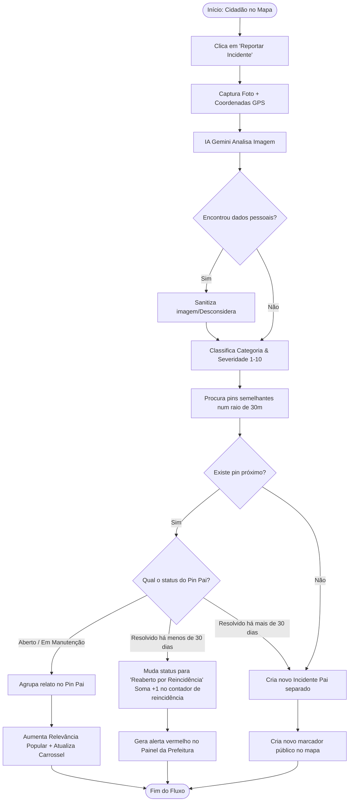
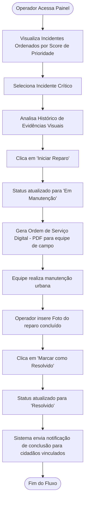

# Guia de UI/UX: Design System no Figma & Fluxos de Navegação

Este guia técnico e visual foi elaborado para dar suporte à entrega de amanhã da A3, contendo a especificação completa de **Design System no Figma**, **Arquitetura de Informação** e os **Diagramas de Fluxo de Processo (UX Flows)** do projeto **UrbanGuard**.

---

## 🎨 1. Figma Style Guide (Design System Blueprint)

Para que as telas no Figma fiquem com a estética premium, limpa e moderna em Dark Mode, configure os seguintes estilos globais no seu projeto Figma:

### A. Paleta de Cores (Figma Color Styles)

| Categoria | Nome do Estilo | Código HEX | Aplicação Visual |
| :--- | :--- | :--- | :--- |
| **Fundo** | `Deep Background` | `#060913` | Fundo principal da aplicação. |
| **Painéis** | `Glass Panel` | `#0D1321` | Fundo de painéis e menus (com opacidade de 80%). |
| **Cards** | `Card Slate` | `#16213A` | Fundo de cartões de incidentes (opacidade de 45%). |
| **Bordas** | `Border White` | `#FFFFFF` | Bordas finas de 1px (opacidade de 8%). |
| **Destaque 1**| `Cyan Neon` | `#00F2FE` | Links, botões primários e marcações ativas. |
| **Destaque 2**| `Emerald Glow` | `#10B981` | Status "Resolvido", caminhos seguros e sucessos. |
| **Destaque 3**| `Amber Warning`| `#F59E0B` | Status "Em Manutenção" e alertas moderados. |
| **Destaque 4**| `Crimson Alert`| `#EF4444` | Status "Reaberto/Reincidente" e áreas de alto risco. |
| **Texto 1** | `Text Primary` | `#F3F4F6` | Títulos e textos de alta legibilidade. |
| **Texto 2** | `Text Secondary`| `#9CA3AF` | Subtítulos e parágrafos de descrição. |
| **Texto 3** | `Text Muted` | `#6B7280` | Placeholders de input e textos secundários desativados. |

### B. Tipografia (Figma Text Styles)

Use duas fontes do Google Fonts no Figma para criar um contraste sofisticado:
*   **Outfit** (para Títulos, Títulos de Seção e Badges)
*   **Plus Jakarta Sans** (para Parágrafos, Labels, Botões e Inputs)

#### Escala Tipográfica:
*   **Título Principal (H1):** Outfit, Bold (700), Size: `32px` | Line-Height: `120%` (Telas de Boas-vindas / Estatísticas).
*   **Título de Seção (H2):** Outfit, SemiBold (600), Size: `20px` | Line-Height: `125%` (Ex: "Ocorrências Próximas").
*   **Subtítulo (Subtitle):** Plus Jakarta Sans, Medium (500), Size: `15px` | Line-Height: `140%`.
*   **Corpo de Texto (Body):** Plus Jakarta Sans, Regular (400), Size: `14px` | Line-Height: `150%` (Parágrafos de descrição).
*   **Labels e Botões (Button/Label):** Plus Jakarta Sans, Bold (700), Size: `13px` | Letter-spacing: `5%` (Mais espaçado para botões).
*   **Micro Text / Badges (Caption):** Outfit, ExtraBold (800), Size: `11px` | All Caps (Letras maiúsculas).

### C. Efeitos de Vidro e Brilho (Figma Effects)

*   **Efeito Glassmorphism (Painéis):**
    *   Adicionar `Background Blur` com valor de `16` a `20`.
    *   Adicionar preenchimento (`Fill`) de cor `#0D1321` com opacidade em `80%`.
    *   Adicionar contorno (`Stroke`) de cor `#FFFFFF` com opacidade em `8%`.
*   **Sombra Neon (Glow):**
    *   Adicionar `Drop Shadow` em botões primários: Cor `#00F2FE` (Cyan), Opacidade: `25%`, X: `0`, Y: `4`, Blur: `15px`.
*   **Sombra de Elevação (Cards):**
    *   Adicionar `Drop Shadow`: Cor `#000000`, Opacidade: `40%`, X: `0`, Y: `8`, Blur: `32px`.

---

## 🧭 2. Fluxos de Navegação e UX Flows

Para o relatório escrito e para estruturar a prototipagem no Figma, dividimos a plataforma em **três fluxos de usuários cruciais**.

### Fluxo A: Cidadão Reportando Problema na Via (Crowdsourcing)
1.  **Tela de Login/Cadastro:** Cidadão acessa o app.
2.  **Mapa Principal:** Cidadão visualiza o mapa da cidade com pins ao redor e clica no botão flutuante **"Reportar Incidente (ícone de Câmera)"**.
3.  **Tela de Captura:** O app abre a câmera. O cidadão enquadra o problema e tira a foto.
4.  **Processamento da IA (Gemini):** O sistema exibe uma tela de carregamento animada mostrando que a IA está analisando a imagem.
    *   *Feedback UX:* Aparece uma caixa delimitadora (Bounding Box) neon ao redor do buraco na foto com a classificação e severidade calculada.
5.  **Confirmação do Relato:** O app exibe o endereço obtido via GPS automático. O cidadão clica em **"Confirmar Envio"**.
6.  **Algoritmo de Proximidade (Agrupamento):**
    *   *Se houver outro buraco a menos de 30m:* A IA avisa que o problema já foi reportado e pergunta se ele quer apenas apoiar. Se sim, agrega a nova foto ao histórico sob um único pin.
    *   *Se for um ponto isolado:* Cria um novo pin e redireciona o cidadão de volta para o mapa principal com um alerta de sucesso.

### Fluxo B: Cidadão Apoiando Ocorrência Existente (Upvote)
1.  **Mapa Principal:** Cidadão navega no mapa e percebe um pin vermelho (indicação de buraco).
2.  **Gaveta de Detalhes (Drawer):** Ao clicar no pin, abre-se uma gaveta na parte inferior da tela (estilo gaveta do Google Maps) contendo:
    *   Foto inicial e descrição do problema.
    *   Carrossel de histórico visual (outras fotos enviadas por pessoas diferentes).
    *   Gráfico de severidade da IA e status do reparo.
3.  **Ação de Apoio:** O cidadão clica em **"Apoiado / Isso também me afeta"**.
4.  **Feedback Visual:** O contador de relevância popular incrementa de imediato, e o pin ganha mais destaque visual (ou calor no heatmap). O cidadão passa a receber notificações sobre este problema.

### Fluxo C: Painel Gerencial da Prefeitura (Workflow Administrativo)
1.  **Login Operador:** Operador público acessa o portal gerencial (Desktop).
2.  **Dashboard de Prioridades:** Visualiza a lista de incidentes ativos, ordenada automaticamente do mais crítico para o menos crítico com base no **Score de Impacto** (IA + Apoios Popular + Reincidência).
3.  **Detalhamento da Ocorrência:** O operador abre a ocorrência, avalia o histórico de fotos e clica em **"Iniciar Reparo"**.
    *   *Ação do sistema:* O status muda para `"Em Manutenção"` e é gerada uma Ordem de Serviço digital com as fotos e geolocalização. O pin do mapa público muda de cor para amarelo.
4.  **Conclusão da Obra:** Após a conclusão, o operador sobe a foto de evidência do reparo no painel e clica em **"Marcar como Resolvido"**.
    *   *Ação do sistema:* O status do incidente pai muda para `"Resolvido"`, a timeline pública do pin é atualizada e **todos** os cidadãos que relataram ou apoiaram aquele pin recebem uma notificação de sucesso e agradecimento.

---

## 📊 3. Diagramas de Fluxo em Mermaid (Prontos para Relatórios)

Vocês podem copiar o código abaixo e colar no site [Mermaid Live Editor](https://mermaid.live) para gerar os diagramas visuais na hora e colocar nos slides ou documentos do trabalho!

### A. Fluxograma Completo do Cidadão e Algoritmo de IA

### B. Fluxograma de Ação Administrativa da Prefeitura

