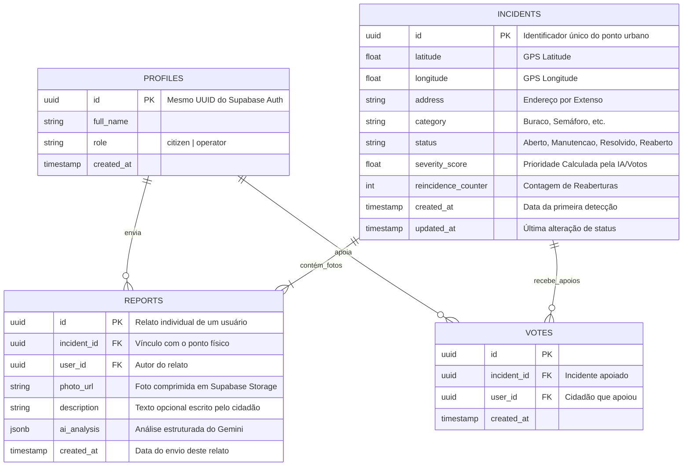

# Refinamento de Projeto - UrbanGuard (Smart Cities)

Este documento apresenta uma análise profunda e propostas de **refinamento conceitual, técnico, de requisitos e modelagem de banco de dados** para o projeto **UrbanGuard**, baseado nas discussões de refinamento para a atividade avaliativa A3 de Engenharia de Software.

O objetivo deste documento é fornecer uma especificação técnica formal completa, pronta para elevar o nível acadêmico do trabalho perante a banca avaliadora.

---

## 🌟 1. Pontos Fortes do Rascunho Inicial

A estrutura proposta pelo seu grupo destaca-se pelos seguintes pilares:
*   **Problema Real e Relevante:** Combate direto à inércia administrativa e burocracia no reporte de danos na infraestrutura urbana de cidades inteligentes.
*   **Arquitetura Moderna:** Combinação do **Supabase (BaaS)** para persistência e autenticação rápida com a API do **Google Gemini (1.5 Flash)** para triagem inteligente e visão computacional leve e eficiente.
*   **Prevenção de Poluição Visual:** O requisito de agrupamento de duplicatas (evitando dezenas de pins para o mesmo buraco) resolve um problema clássico de usabilidade em mapas colaborativos.

---

## 🔧 2. Propostas de Refinamento Técnico e Conceitual

### A. Algoritmo de Agrupamento Espacial-Temporal Híbrido (Refinamento do RF06)
*   **Fase 1 (Proximidade Espacial):** Ao receber um novo reporte com coordenadas GPS, o backend pesquisa reportes da **mesma categoria** em um raio de **30 metros** usando a fórmula de Haversine.
*   **Fase 2 (Janela Temporal e Status):** 
    *   Se houver um pin próximo com status **"Aberto"** ou **"Em Manutenção"**, a IA do Gemini compara as imagens. Confirmando visualmente o mesmo problema, o sistema anexa a foto nova a esse pin existente (agrupamento).
    *   Se o pin próximo estiver marcado como **"Resolvido"** há **menos de 30 dias**, a nova denúncia é registrada como uma **Reincidência (Falha de Reparo)**. O status do pin muda para **"Reaberto por Reincidência"** e seu contador de reincidência é incrementado, gerando alerta vermelho no painel da prefeitura.
    *   Se estiver resolvido há **mais de 30 dias**, o sistema assume que o problema original foi sanado e este é um novo desgaste natural, criando uma ocorrência distinta.

### B. Score de Impacto e Priorização Inteligente (Triage por IA)
Para otimizar os recursos públicos, a IA do Gemini avalia a severidade física da ocorrência em uma escala de 1 a 10 (ex: cratera em avenida principal = 10, rachadura pequena em calçada residencial = 2).
*   **Fórmula do Score de Impacto:** 
    $$Score = (Gravidade\ Visual\ IA \times 1.5) + (Quantidade\ de\ Apoios\ Cidadãos \times 0.5) + (Reincidências \times 2.0)$$
*   O painel administrativo da prefeitura ordena as ordens de serviço automaticamente por este *Score*, garantindo que os problemas mais graves e reincidentes sejam atendidos primeiro.

---

## 📝 3. Requisitos Formalizados (Padrão de Engenharia de Software)

### Requisitos Funcionais (RF)

*   **RF01 (Captura de Mídia):** O sistema deve permitir que o cidadão tire fotos do incidente pela câmera nativa ou escolha da galeria.
*   **RF02 (Geolocalização Automática):** O sistema deve capturar a latitude e longitude precisas do local do reporte no momento do envio via GPS do aparelho.
*   **RF03 (Visualização Espacial e Heatmap):** O sistema deve exibir um mapa interativo com marcadores categorizados e uma camada de mapa de calor pública para visualização de densidade de problemas.
*   **RF04 (Painel do Cidadão):** O sistema deve oferecer um painel histórico onde o cidadão consulte o andamento de seus próprios envios e apoios.
*   **RF05 (Carrossel de Evidências):** O sistema deve armazenar e exibir uma linha do tempo visual das fotos enviadas para o mesmo ponto urbano, permitindo comparar o antes e depois.
*   **RF06 (Algoritmo de Agrupamento e Reincidência):** O sistema deve rodar um algoritmo de proximidade geográfica (30m) e comparação de IA para associar novos envios a incidentes existentes, reabrindo ocorrências fechadas caso o problema retorne em menos de 30 dias.
*   **RF07 (Autenticação e Perfis ACL):** O sistema deve separar acessos entre *Perfil Cidadão* (público/cadastro simples) e *Perfil Operador da Prefeitura* (acesso ao painel gerencial).
*   **RF08 (Atualização de Status de Reparo):** O sistema deve permitir que o operador altere o status de um incidente (Aberto ➡️ Em Manutenção ➡️ Resolvido).
*   **RF09 (Sistema de Apoio / "Voto de Apoio"):** O sistema deve permitir que cidadãos cliquem em "Apoiado" em pins já existentes no mapa. Isso incrementa a urgência do pin sem gerar registros duplicados ou downloads desnecessários de novas mídias.
*   **RF10 (Filtros Dinâmicos no Mapa):** O sistema deve fornecer filtros por categoria (iluminação, asfalto, saneamento), status e nível de gravidade.
*   **RF11 (Notificações In-App de Feedback):** O sistema deve enviar notificações internas para os cidadãos que relataram ou apoiaram um pin sempre que a prefeitura atualizar o seu progresso.
*   **RF12 (Geração de Ordem de Serviço - OS):** O sistema deve gerar uma OS digital (PDF) automática quando a prefeitura mover o status para "Em Manutenção", contendo endereço, foto, gravidade e espaço para a assinatura do técnico de campo.
*   **RF13 (Geocodificação Reversa):** O sistema deve traduzir as coordenadas de GPS capturadas em um endereço textual legível (rua, número aproximado, bairro, cidade) no envio do reporte.
*   **RF14 (Gamificação Cidadã):** O sistema deve conceder pontos e conquistas virtuais (*"Fiscal Urbano"*, *"Guardião do Bairro"*) para incentivar a colaboração contínua da comunidade.

### Requisitos Não Funcionais (RNF)

*   **RNF01 (Segurança e LGPD):** O sistema deve armazenar as mídias e logs de geolocalização com segurança no Supabase, garantindo a anonimização de rostos/placas processados pela IA (sem armazenamento de dados pessoais no reporte).
*   **RNF02 (Usabilidade Mobile-First):** A interface da webapp deve ser otimizada para navegadores móveis, com tempo de carregamento inicial menor que 2 segundos.
*   **RNF03 (Tempo de Resposta da IA):** A análise de imagem, triagem e resposta estruturada em JSON retornada pelo Gemini 1.5 Flash deve ocorrer em até 10 segundos.
*   **RNF04 (Robustez e Simulação Local):** O aplicativo deve tolerar ausência de chaves de API externas ativando um *Local Storage Fallback* (modo simulação local) de forma a manter o funcionamento das telas sem travamentos.
*   **RNF05 (Compressão Client-Side):** O aplicativo deve realizar a compressão de imagens diretamente no navegador do cidadão (máximo 1080px e 80% qualidade JPEG) antes de enviar para poupar rede móvel 3G/4G e custos de nuvem.
*   **RNF06 (Configuração PWA):** A aplicação deve possuir Manifesto PWA e Service Workers configurados para instalação em dispositivos Android e iOS e cache offline da interface gráfica.
*   **RNF07 (Acessibilidade WCAG e eMAG):** O sistema deve seguir os padrões de contraste e semântica do WCAG 2.1 (AA) e do eMAG federal, permitindo uso pleno por leitores de tela e comandos de acessibilidade física.
*   **RNF08 (Rate Limiting de Requisições):** O backend do Supabase deve possuir limitações de taxa (máximo de 3 reportes por hora por usuário) para evitar abuso malicioso ou esgotamento de recursos.
*   **RNF09 (Arquitetura Offline-First / Sincronização Posterior):** O aplicativo deve reter rascunhos de reportes criados sem conexão à internet e realizar a sincronização automática em background assim que detectar o restabelecimento da conectividade de rede.

---

## 🗄️ 4. Modelagem e Arquitetura do Banco de Dados (Supabase)

Para atingir o objetivo de **nunca deletar um incidente físico**, de modo que o histórico de reincidências e reparos fique gravado eternamente no mesmo ID, propomos uma arquitetura relacional em **Pai e Filho (Master-Detail)** no Supabase.

### Diagrama Entidade-Relacionamento (ER)



### Explicação da Organização de Dados

1.  **Tabela `incidents` (Ponto Físico Eterno):**
    *   Esta tabela guarda a localização física do problema urbano (ex: "O buraco no asfalto na Avenida Getúlio Vargas, nº 450").
    *   **Nunca é deletada.** 
    *   Quando um reparo é realizado, seu status vai para `"resolvido"`. O pin fica verde no mapa histórico ou pode ser ocultado do mapa principal público usando filtros, mas continua existindo no banco.
    *   Se o mesmo buraco reabrir nas mesmas coordenadas, o status de `incidents` muda para `"reaberto"` e o campo `reincidence_counter` é incrementado em `1`.

2.  **Tabela `reports` (A Evolução Temporal / Filhos):**
    *   Sempre que um usuário envia um novo reporte ou tira uma foto daquele mesmo buraco, um novo registro é inserido em `reports` apontando para o `incident_id` pai.
    *   Graças a isso, temos um **histórico de progresso perfeito** (RF05). Um único buraco físico pode ter relatos vinculados a ele ao longo do tempo (antes, durante e depois das intervenções urbanas).

3.  **Tabela `votes` (Prevenção de Abuso e Multiplicação):**
    *   Guarda os apoios dos cidadãos. Possui uma chave única composta por `(incident_id, user_id)` impedindo que o mesmo usuário clique em "apoiar" mais de uma vez na mesma ocorrência.
    *   Alimenta diretamente a fórmula do score de impacto de forma orgânica e leve.

### Código DDL SQL para criação direta no Supabase

```sql
-- 1. Perfis de Usuário (Estende o Supabase Auth com permissões)
CREATE TABLE profiles (
    id UUID REFERENCES auth.users ON DELETE CASCADE PRIMARY KEY,
    full_name TEXT NOT NULL,
    role TEXT DEFAULT 'citizen' CHECK (role IN ('citizen', 'operator')),
    created_at TIMESTAMP WITH TIME ZONE DEFAULT TIMEZONE('utc'::text, NOW()) NOT NULL
);

-- 2. Incidentes (O Ponto Físico Eterno no Espaço Urbano - NUNCA É DELETADO)
CREATE TABLE incidents (
    id UUID DEFAULT gen_random_uuid() PRIMARY KEY,
    latitude DOUBLE PRECISION NOT NULL,
    longitude DOUBLE PRECISION NOT NULL,
    address TEXT, -- Preenchido automaticamente via Geocodificação Reversa (RF13)
    category TEXT NOT NULL CHECK (category IN ('buraco', 'iluminacao', 'semaforo', 'vandalismo', 'saneamento', 'outros')),
    status TEXT DEFAULT 'aberto' CHECK (status IN ('aberto', 'em_manutencao', 'resolvido', 'reaberto_por_reincidencia')),
    severity_score DOUBLE PRECISION DEFAULT 1.0, -- Prioridade calculada (IA + Votos)
    reincidence_counter INTEGER DEFAULT 0, -- Quantidade de vezes que reabriu
    created_at TIMESTAMP WITH TIME ZONE DEFAULT TIMEZONE('utc'::text, NOW()) NOT NULL,
    updated_at TIMESTAMP WITH TIME ZONE DEFAULT TIMEZONE('utc'::text, NOW()) NOT NULL
);

-- 3. Relatos Individuais (Mídias, Comentários e Evidências Vinculadas ao Incidente Pai)
CREATE TABLE reports (
    id UUID DEFAULT gen_random_uuid() PRIMARY KEY,
    incident_id UUID REFERENCES incidents(id) ON DELETE CASCADE NOT NULL, -- Vinculo Pai-Filho
    user_id UUID REFERENCES profiles(id) ON DELETE SET NULL, -- Quem reportou
    photo_url TEXT NOT NULL, -- Link da foto comprimida salva no Supabase Storage
    description TEXT, -- Comentário adicional do cidadão
    ai_analysis JSONB, -- Triagem bruta em JSON do Gemini (classes, severidade)
    created_at TIMESTAMP WITH TIME ZONE DEFAULT TIMEZONE('utc'::text, NOW()) NOT NULL
);

-- 4. Votos de Apoio dos Cidadãos (Upvotes para evitar pins duplicados)
CREATE TABLE votes (
    id UUID DEFAULT gen_random_uuid() PRIMARY KEY,
    incident_id UUID REFERENCES incidents(id) ON DELETE CASCADE NOT NULL,
    user_id UUID REFERENCES profiles(id) ON DELETE CASCADE NOT NULL,
    created_at TIMESTAMP WITH TIME ZONE DEFAULT TIMEZONE('utc'::text, NOW()) NOT NULL,
    UNIQUE (incident_id, user_id) -- Chave única: impede que o mesmo usuário apoie mais de uma vez a mesma ocorrência
);
```

---

## 🚦 5. Fluxo de Vida e Transições de Status

Abaixo, representamos o ciclo de vida do incidente urbano no banco de dados e como a IA interage com a modelagem proposta:

```
[ Novo Relato Capturado ]
        │
        ▼
[ Consulta Geográfica (30m) ] ──(Não encontrou nenhum pin próximo)──▶ [ Cria Novo INCIDENT + REPORT ] (Status: "Aberto")
        │
        └─(Encontrou Pin nos arredores)
                 │
                 ▼
     [ Gemini Compara Imagens ]
                 │
                 ├─(São problemas diferentes)──────▶ [ Cria Novo INCIDENT + REPORT ] (Status: "Aberto")
                 │
                 └─(É o mesmo problema urbano)
                           │
                           ▼
          [ Verifica Status do Incidente Pai ]
                           │
                           ├─(Status: "Aberto" ou "Em Manutenção")
                           │         │
                           │         ▼
                           │   [ Agrupa REPORT no INCIDENT existente ]
                           │   (Incrementa urgência no mapa)
                           │
                           └─(Status: "Resolvido" há menos de 30 dias)
                                     │
                                     ▼
                               [ REABRE O INCIDENT ]
                               (Status: "Reaberto por Reincidência")
                               (Incrementa reincidence_counter + 1)
                               (Gera alerta vermelho no Painel)
```

---

## 📑 6. Aspectos de Privacidade e Ética (Para o Trabalho Escrito)

Ao apresentar esse modelo de dados para os professores, o seu grupo pode justificar a arquitetura sob duas premissas éticas cruciais:

1.  **Proteção de Dados Pessoais (LGPD):** Os cidadãos são identificados no banco apenas para controle de gamificação e prevenção de spam (evitar robôs poluindo o mapa). No mapa público e nas informações compartilhadas com a prefeitura sobre o dano físico, os dados pessoais dos denunciantes são omitidos, focando exclusivamente nas fotos e endereço do dano da via. Além disso, as fotos das mídias não contêm dados biométricos nem identificadores não-públicos (graças à triagem de privacidade do Gemini).
2.  **Transparência Pública Ativa:** Manter as ocorrências resolvidas de forma histórica impede que a prefeitura "apague os rastros" de manutenções mal executadas. A população pode auditar quais ruas sofrem reincidência contínua de buracos, promovendo uma fiscalização cidadã real sobre a qualidade das obras contratadas pelo município.
