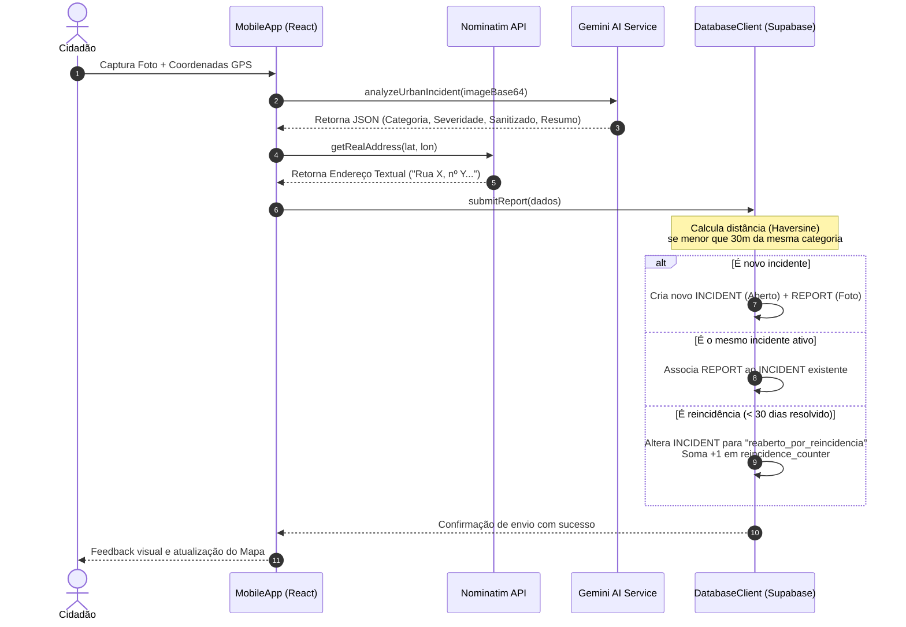
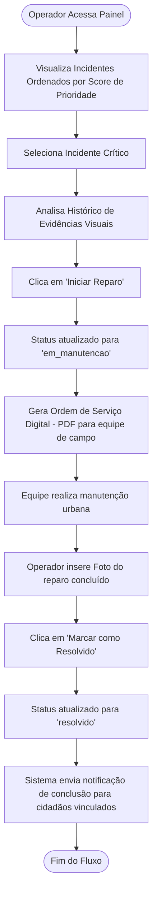
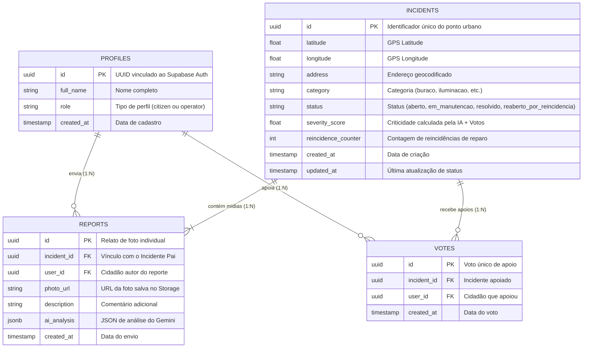

# 🛡️ UrbanGuard - Zeladoria Urbana Colaborativa
## Documentação de Fluxos de Funcionamento e Arquitetura de Classes

Este documento descreve detalhadamente o fluxo de funcionamento e o diagrama de classes do projeto **UrbanGuard**, baseado no código-fonte atual e nas especificações de Engenharia de Software do sistema.

---

## 🚦 1. Fluxo de Funcionamento (Como o Sistema Funciona)

O **UrbanGuard** é baseado na colaboração ativa dos cidadãos (crowdsourcing) aliada à triagem automatizada por Inteligência Artificial (Google Gemini) e à gestão inteligente de incidentes pela prefeitura.

### A. Fluxo Principal: Cidadão Reportando Incidente (Mobile-First)

Este fluxo descreve o caminho percorrido desde o momento em que o cidadão encontra um problema na rua até que a prefeitura seja notificada:

1. **Acesso & Autenticação:**
   - O cidadão se autentica (ou entra via Modo Demo Local, que utiliza o `LocalStorage` como banco simulado).
2. **Captura do Dano (Câmera & GPS):**
   - O cidadão visualiza o mapa e clica no botão "Reportar".
   - A câmera do dispositivo é ativada para tirar a foto do incidente (ex: um buraco no asfalto).
   - O GPS captura as coordenadas exatas de latitude e longitude.
3. **Compressão Client-Side:**
   - A imagem é comprimida diretamente no navegador do cidadão para economizar banda de internet móvel antes do envio.
4. **Triagem Inteligente (IA Gemini):**
   - A foto é enviada em base64 para o `GeminiService` (usando `gemini-3.1-flash-lite`).
   - A IA analisa a imagem e retorna um JSON padronizado com:
     - **Categoria:** (`buraco`, `iluminacao`, `semaforo`, `vandalismo`, `saneamento` ou `outros`).
     - **Severidade:** Pontuação de 1 a 10 (nível do estrago/risco).
     - **Sanitização (LGPD):** Confirmação de que rostos e placas de veículos foram desconsiderados.
     - **Resumo:** Descrição textual curta em português do problema observado.
5. **Geocodificação Reversa:**
   - A aplicação faz uma requisição gratuita à API do Nominatim (OpenStreetMap) usando a latitude/longitude para obter o endereço por extenso (rua, número aproximado, bairro, cidade).
6. **Algoritmo de Deduplicação Espacial (Haversine 30m):**
   - O sistema pesquisa na base de dados se já existe um incidente da **mesma categoria** num raio de **30 metros**.
   - **Cenário 1: Não há pin próximo**
     - O sistema cria um novo registro de `Incident` (Pai) com status `"aberto"` e adiciona o primeiro `Report` (Filho) contendo a foto e a análise de IA.
   - **Cenário 2: Há um pin próximo e ativo (Aberto ou Em Manutenção)**
     - O sistema não polui o mapa com um novo pin. Ele vincula o novo relato (`Report` filho) ao `Incident` (Pai) existente. Isso anexa a nova foto à linha do tempo e aumenta o Score de Prioridade.
   - **Cenário 3: Há um pin próximo que foi marcado como Resolvido**
     - **Resolvido há menos de 30 dias:** É considerado uma falha no reparo (reincidência). O status do incidente muda para `"reaberto_por_reincidencia"`, incrementa o contador de reincidência em 1 e gera um alerta vermelho prioritário.
     - **Resolvido há mais de 30 dias:** O sistema assume que é um novo problema de desgaste natural e cria um novo incidente pai separado.



---

### B. Fluxo: Gestão Pública (Painel da Prefeitura)

Este fluxo descreve o gerenciamento pela equipe da prefeitura através do **AdminDashboard**:

1. **Autenticação de Operador:**
   - O operador faz login com credenciais administrativas (`role: 'operator'`).
2. **Dashboard de Prioridade Dinâmica:**
   - O operador visualiza a lista de incidentes ativos ordenada automaticamente pelo **Score de Impacto**, calculado com base na fórmula:
     $$Score = (Gravidade\ IA \times 1.5) + (Apoios\ Populares \times 0.5) + (Reincidências \times 2.0)$$
   - Isso garante que incidentes reincidentes e muito apoiados fiquem no topo da fila de reparos.
3. **Avaliação e Abertura de Ordem de Serviço (OS):**
   - O operador seleciona o incidente e visualiza o histórico de fotos (antes/depois) enviadas.
   - Ao clicar em "Iniciar Reparo", o status do incidente pai é atualizado para `"em_manutencao"` (o marcador no mapa público dos cidadãos muda de cor).
   - O sistema gera um PDF padronizado com a Ordem de Serviço para envio à equipe de campo.
4. **Finalização do Reparo:**
   - A equipe de campo conclui o conserto.
   - O operador anexa uma foto comprobatória do reparo e muda o status para `"resolvido"`.
   - O sistema envia notificações para todos os cidadãos que enviaram relatos ou apoiaram aquele incidente, agradecendo pela colaboração.



---

## 🗄️ 2. Modelo Relacional de Dados (Banco de Dados Supabase)

O banco de dados é modelado no padrão **Mestre-Detalhe (Pai-Filho)**. Um incidente físico (pai) é eterno no espaço geográfico, contendo múltiplos reportes e mídias (filhos) que mostram o seu ciclo de vida.



---

## 📊 3. Diagrama de Classes e Componentes (Arquitetura de Software)

O diagrama abaixo mapeia a estrutura lógica do front-end em **React/TypeScript**, ilustrando a separação entre componentes de UI, páginas de rotas e os serviços de infraestrutura (`DatabaseClient` e `GeminiService`).

```mermaid
classDiagram
    %% Modelos e Interfaces
    class Incident {
        <<interface>>
        +string id
        +number latitude
        +number longitude
        +string address
        +string category
        +string status
        +number severity_score
        +number reincidence_counter
        +string created_at
        +string updated_at
    }

    class Report {
        <<interface>>
        +string id
        +string incident_id
        +string user_id
        +string photo_url
        +string description
        +AITriageResult ai_analysis
        +string created_at
    }

    class AITriageResult {
        <<interface>>
        +string category
        +number severity
        +boolean sanitized
        +string summary
        +boolean is_simulated
        +string simulated_reason
    }

    %% Classes de Serviço / Infraestrutura
    class DatabaseClient {
        +boolean isDemo
        +SupabaseClient supabase
        +loadClientConfig() void
        +setForceDemo(boolean value) void
        +login(string email, string password, boolean bypass) Promise
        +signUp(string email, string password, string fullName) Promise
        +logout() Promise
        +getCurrentUser() any
        +getIncidents() Promise
        +getReports(string incidentId) Promise
        +submitReport(any data) Promise
        +updateIncidentStatus(string incidentId, string newStatus) Promise
        +supportIncident(string incidentId) Promise
    }

    class GeminiService {
        -string apiKey
        -string modelName
        +setApiKey(string key) void
        +hasApiKey() boolean
        +analyzeUrbanIncident(string imageBase64, string mimeType) Promise
        +simulateAITriage(boolean failedApi) Promise
    }

    %% Páginas da Aplicação
    class MobileApp {
        <<React Page>>
        +incidents Incident[]
        +selectedIncident Incident
        +activeTab string
        +loadData() void
        +handleLogout() void
    }

    class AdminDashboard {
        <<React Page>>
        +incidents Incident[]
        +selectedIncident Incident
        +loadIncidents() void
        +handleStatusChange(string incidentId, string status) void
        +generateOS(Incident inc) void
    }

    class Login {
        <<React Page>>
        +email string
        +password string
        +handleLogin() void
    }

    class Signup {
        <<React Page>>
        +fullName string
        +email string
        +handleSignup() void
    }

    %% Componentes Reutilizáveis
    class MapView {
        <<React Component>>
        +incidents Incident[]
        +selectedIncident Incident
        +onSelectIncident(Incident inc) void
    }

    class BottomSheet {
        <<React Component>>
        +incident Incident
        +reports Report[]
        +handleSupport() void
    }

    class ReportForm {
        <<React Component>>
        +onCancel() void
        +onSubmitSuccess() void
        +takePhoto() void
        +handleSubmit() void
    }

    class Settings {
        <<React Component>>
        +onCancel() void
        +refreshData() void
        +onLogout() void
    }

    %% Associações e Dependências
    DatabaseClient ..> Incident : gerencia e retorna
    DatabaseClient ..> Report : gerencia e retorna
    Report --> AITriageResult : possui metadados de
    
    MobileApp --> MapView : renderiza
    MobileApp --> BottomSheet : renderiza
    MobileApp --> BottomNav : renderiza
    MobileApp --> TopBar : renderiza
    MobileApp --> ReportForm : renderiza
    MobileApp --> Settings : renderiza

    MobileApp ..> DatabaseClient : usa (instância db)
    AdminDashboard ..> DatabaseClient : usa (instância db)
    Login ..> DatabaseClient : usa (instância db)
    Signup ..> DatabaseClient : usa (instância db)
    BottomSheet ..> DatabaseClient : usa (instância db)
    Settings ..> DatabaseClient : usa (instância db)
    
    ReportForm ..> DatabaseClient : usa (instância db)
    ReportForm ..> GeminiService : usa (instância ai)
