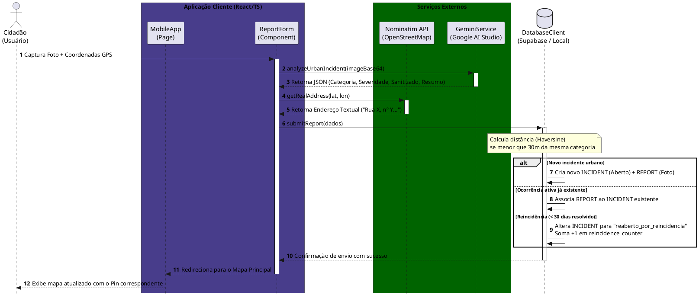
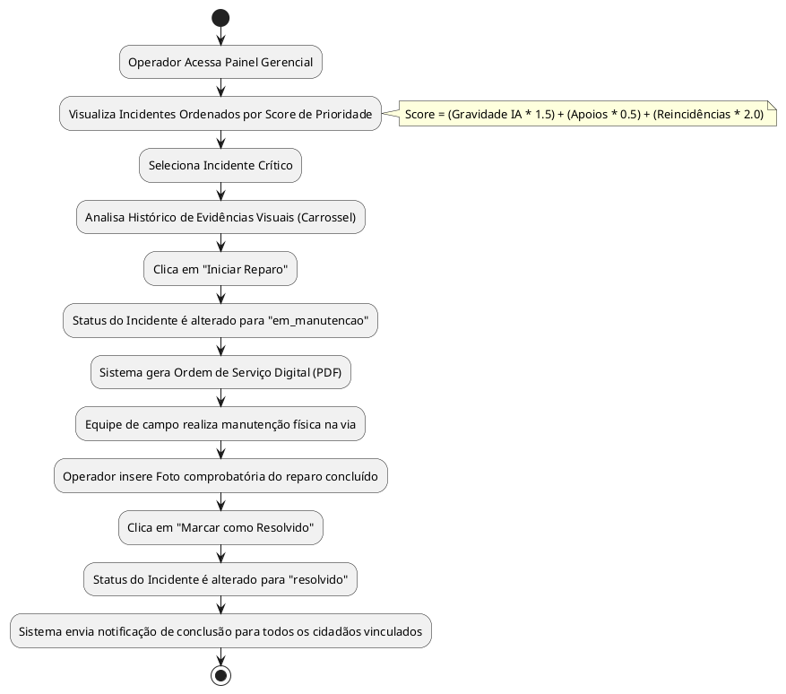
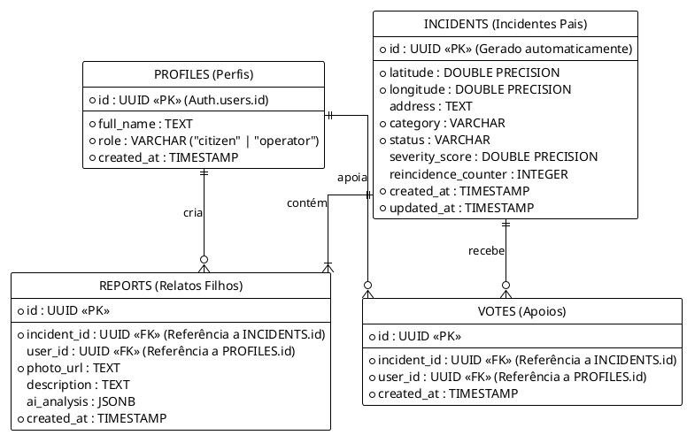

# 🛡️ UrbanGuard - Zeladoria Urbana Colaborativa
## Diagramas de Fluxo e Classes em PlantUML

Este documento contém os diagramas de fluxos e arquitetura do projeto **UrbanGuard** descritos na linguagem **PlantUML**. Você pode copiar e colar cada bloco de código no site [PlantText](https://www.planttext.com/) ou no editor de sua preferência para renderizá-los.

---

## 🚦 1. Fluxo de Sequência: Cidadão Reportando Incidente

Este diagrama detalha o processo desde a captura da foto pelo celular do cidadão, passando pela análise automática da IA (Gemini) e geocodificação, até o processamento lógico e armazenamento final (Supabase).



---

## 🛠️ 2. Fluxo de Atividade: Gestão Pública (Operador da Prefeitura)

Este diagrama representa o fluxo de trabalho administrativo do operador municipal a partir do painel de controle.



---

## 📊 3. Diagrama de Classes e Componentes do Sistema (React + Services)

Mapeamento da arquitetura de classes, interfaces de dados e componentes React/TypeScript utilizados na solução.

```plantuml
@startuml
skinparam linetype ortho
skinparam PackageBackgroundColor #LightYellow
skinparam ClassBackgroundColor #Aqua-White

package "Interfaces de Dados (Models)" {
  interface Incident {
    + id : string
    + latitude : number
    + longitude : number
    + address : string
    + category : string
    + status : string
    + severity_score : number
    + reincidence_counter : number
    + created_at : string
    + updated_at : string
  }

  interface Report {
    + id : string
    + incident_id : string
    + user_id : string
    + photo_url : string
    + description : string
    + ai_analysis : AITriageResult
    + created_at : string
  }

  interface AITriageResult {
    + category : string
    + severity : number
    + sanitized : boolean
    + summary : string
    + is_simulated : boolean
    + simulated_reason : string
  }
}

package "Serviços de Infraestrutura (Services)" {
  class DatabaseClient {
    + isDemo : boolean
    + supabase : SupabaseClient
    + loadClientConfig() : void
    + setForceDemo(value : boolean) : void
    + login(email, password, bypass) : Promise
    + signUp(email, password, fullName) : Promise
    + logout() : Promise
    + getCurrentUser() : any
    + getIncidents() : Promise
    + getReports(incidentId) : Promise
    + submitReport(data) : Promise
    + updateIncidentStatus(incidentId, newStatus) : Promise
    + supportIncident(incidentId) : Promise
  }

  class GeminiService {
    - apiKey : string
    - modelName : string
    + setApiKey(key : string) : void
    + hasApiKey() : boolean
    + analyzeUrbanIncident(imageBase64, mimeType) : Promise<AITriageResult>
    + simulateAITriage(failedApi) : Promise<AITriageResult>
  }
}

package "Páginas (Routes/Pages)" {
  class MobileApp {
    + incidents : Incident[]
    + selectedIncident : Incident
    + activeTab : string
    + loadData() : void
    + handleLogout() : void
  }

  class AdminDashboard {
    + incidents : Incident[]
    + selectedIncident : Incident
    + loadIncidents() : void
    + handleStatusChange(id, status) : void
    + generateOS(inc) : void
  }

  class Login {
    + email : string
    + password : string
    + handleLogin() : void
  }

  class Signup {
    + fullName : string
    + email : string
    + handleSignup() : void
  }
}

package "Componentes Visuais (Components)" {
  class MapView {
    + incidents : Incident[]
    + selectedIncident : Incident
    + onSelectIncident(inc) : void
  }

  class BottomSheet {
    + incident : Incident
    + reports : Report[]
    + handleSupport() : void
  }

  class ReportForm {
    + onCancel() : void
    + onSubmitSuccess() : void
    + takePhoto() : void
    + handleSubmit() : void
  }

  class Settings {
    + onCancel() : void
    + refreshData() : void
    + onLogout() : void
  }
}

%% Relacionamentos
DatabaseClient ..> Incident : gerencia >
DatabaseClient ..> Report : gerencia >
Report --> AITriageResult : possui >

MobileApp --> MapView : renderiza >
MobileApp --> BottomSheet : renderiza >
MobileApp --> ReportForm : renderiza >
MobileApp --> Settings : renderiza >

MobileApp ..> DatabaseClient : usa >
AdminDashboard ..> DatabaseClient : usa >
Login ..> DatabaseClient : usa >
Signup ..> DatabaseClient : usa >
BottomSheet ..> DatabaseClient : usa >
Settings ..> DatabaseClient : usa >

ReportForm ..> DatabaseClient : usa >
ReportForm ..> GeminiService : usa >
@enduml
```

---

## 🗄️ 4. Diagrama Entidade-Relacionamento (Banco de Dados Supabase)

Modelo relacional do banco de dados na estrutura Mestre-Detalhe (Pai-Filho).


